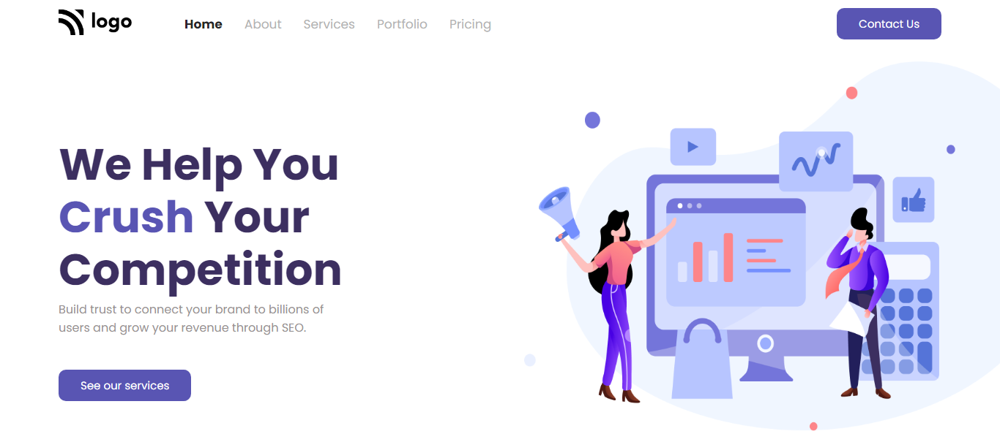

# Digital Marketing HomePage
 

**Hi everyone, I am Raushan Kumar😃.**

>This project is a landing page of a digital marketing agency💻. This particular project used `flexbox` and some concepts of `positions` extensively.

- This is really a good project to learn building good looking and interactive landing pages😉. Especially the font and color combination used make it look even better and professional😎.

- Key learning are follows:
    - designing good looking and interactive navbars
    - aligning content with an image
    - using positions for footer button

Below is the link and the view of the page👇👇 
[Digitalverse](https://digitalverse.netlify.app/)

